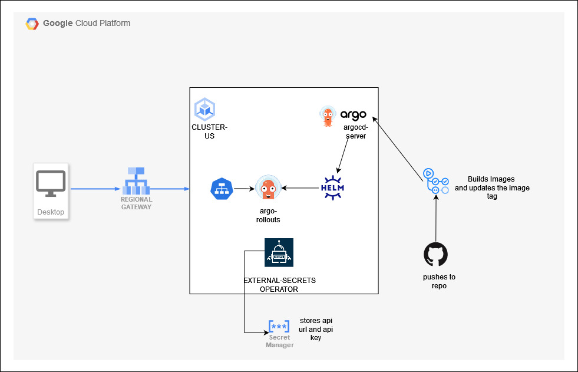
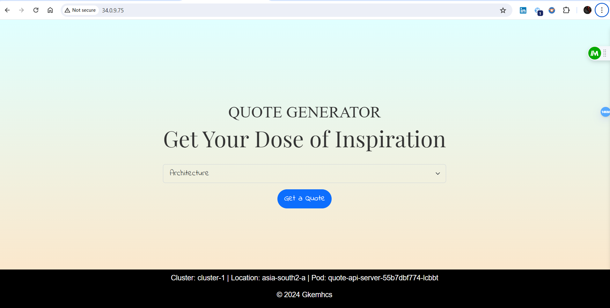
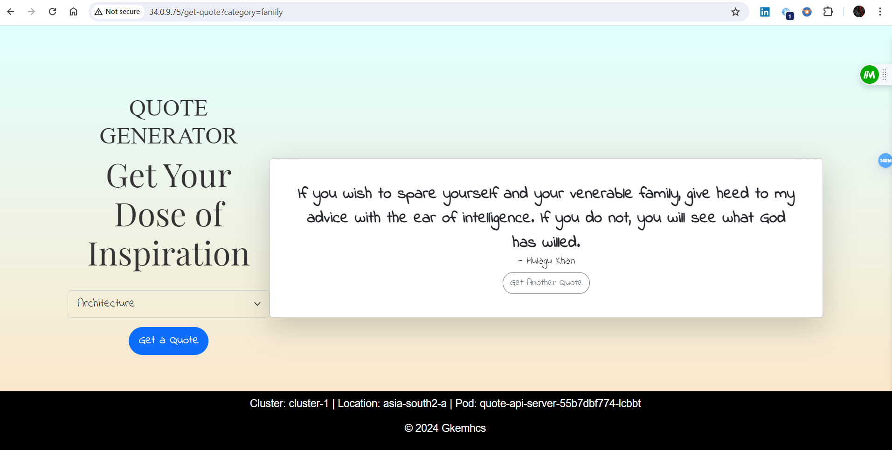

# QUOTE-GENERATOR-API
### A Simple Kubernetes API Gateway backed by Argo Rollouts with CI/CD enabled through ArgoCD using GitOps
## Tools Used:
 - **Google Kubernetes Engine**: used for deployment of  k8s services including Argo Rollouts,Services,Gateway,Secrets
 - **Google Cloud API Gateway**: A regional LoadBalancer deployed to serve the quote-api service 
 - **Google Cloud Secret Manager**: to store API Credentials such as API_HOST_URL AND API_KEY
 - **ArgoCD**: automation of ci/cd deployment to GKE using GitOps 
 - **Argo Rollouts**: used rollout template instead of deployments to leverage canary deployment 
 - **HelmCharts**:  used  helm package manager for k8s to deploy the services in gke cluster 
 - **ExternalSecrets**:  custom operator to pull secrets from credentials related to api fro GCPSM(Google Cloud Secret Manager)
 - **Github-Actions**: whenever developer commits to repo ,workflows builds an docker image and pushes it to google artifact registry and updates the image tag in rollout manifest.
 - **Workload-Identity-Federation** : used to authenticate to Google Cloud APIS from Github leevraging keyless authentication
- **Terraform**: used Terraform to automate the infrastructure
 ##### Here is the architecture of  quote-generator-api project 
 
 ##### Here are some images of project
**Home page**
 
 

**Quote page**


#### STEPS TO DEPLOY THE PROJECT

**Step 1: Clone this repo to your local workstation**
```bash
git clone https://github.com/Gkemhcs/argocd-gke.git
cd argocd-gke
```
**Step 2: Let`s configure some environment variables**
```bash
echo "Enter Your Project ID"
read PROJECT_ID
gcloud config set $PROJECT_ID

echo "Enter Your Github repo name in form Owner/repo-name"
read GITHUB_REPO
echo ""
```
**Step3 : Lets deploy the infrastructure using terraform**
```bash
cd infra
terraform init 
terraform apply -var GITHUB_REPO=$GITHUB_REPO \
-var PROJECT_ID=$PROJECT_ID \
-var 'API_CREDS={API_HOST="https://api.api-ninjas.com/v1/quotes",API_KEY="REPLACE_WITH_YOUR_API_KEY_HERE"}' \
-auto-approve
```
**Step4: Now using the outputs generated by terraform create github secrets in your repo with names WIF_PROVIDER  AND WIF_SERVICE_ACCOUNT  with respective values  displayed in terraform output**

**Step5: Now  create Github Variables named GAR_LOCATION AND GAR_REPOSITORY  with  VALUES  us-central1 and quote-repo respectively**

**Step6: Now we need to  install argocd and argorollout and external secret operator binaries into our gke cluster**
```bash
gcloud container clusters get-credentials cluster-us-1 --zone us-central1-a
echo "INSTALLING EXTERNAL SECRETS OPERATOR"
helm repo add external-secrets https://charts.external-secrets.io

helm install external-secrets \
   external-secrets/external-secrets \
    -n external-secrets \
    --create-namespace \
  # --set installCRDs=true

echo "EXTERNAL SECRETS OPERATOR INSTALLATION COMPLETE"
echo "INSTALLING ARGOCD OPERATOR"
kubectl create namespace argocd
kubectl apply -n argocd -f https://raw.githubusercontent.com/argoproj/argo-cd/stable/manifests/install.yaml
echo "SUCCESSFULLY INSTALLED ARGOCD "
echo "INSTALLING ARGO ROLLOUTS"
kubectl create namespace argo-rollouts
kubectl apply -n argo-rollouts -f https://github.com/argoproj/argo-rollouts/releases/latest/download/install.yaml
```
**step7: This is the final step where we create argocd application to enable ci/cd deployment into gke and then all required services are deployed**

```bash
cd ..
kubectl apply -f Application.yaml
```
###Successfully we deployed our project Now it,s time to experience it 
**step8: Access kubernetes gateway service**
```bash
kubectl get gtw quote-api-gateway -n quote-ns
```
**Now we need to visit the ip address which is showing under address column by setting the host header to quote.api.com**
